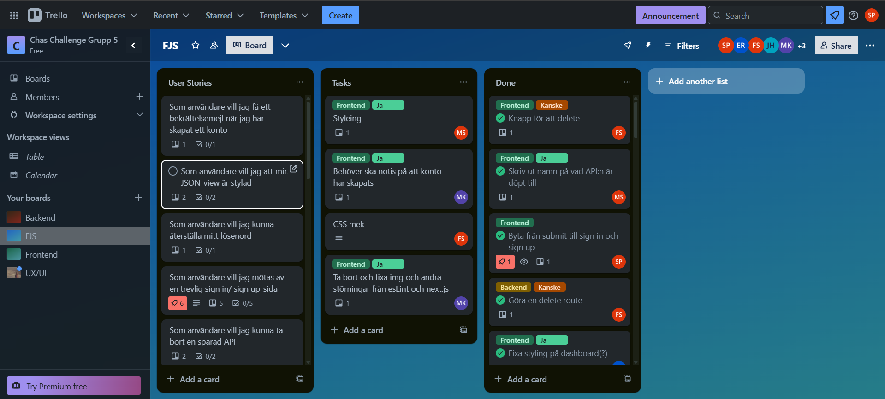
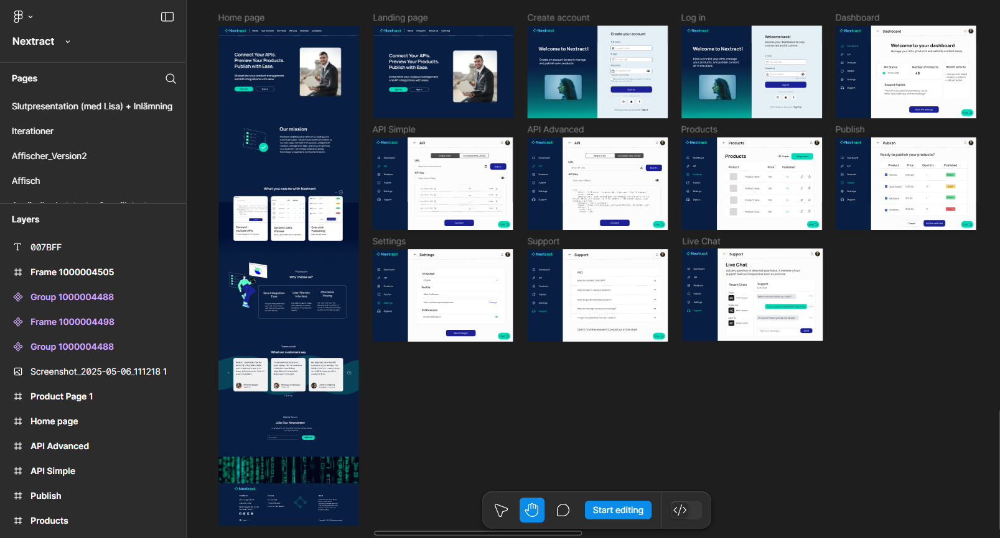

# Nextract 

Nextract is a data selection tool developed with small business owners in mind. For many, cherry picking through large files of products is tedious and time consuming. With Nextract all you need to do is upload your file or insert an API link to get a summary of key names in a simple view. Here you can choose which information is relevant to your business before proceeding to the next page, which allows you to pick which products you would like to display on your website. Nextract also gives you the option to preview how your chosen products would look on a real website. Lastly, all you need to do is save the compiled HTML-file to your device. Fast, easy and simple. 

Get started with Nextract.

## Who are we at Nextract?
Nextract is designed and built by a group of students at Chas Academy located in Stockholm, Sweden. 

### UX/UI team:
* Alexandra Shabardina
* Batoul Ali

### DevOps: 
* Johannes Hedman

### Fullstack Javascript developers: 
* Emil Rönnqvist
* Felix Olsson Stenersjö
* Moa Sjögren
* Mladen Kovacic
* Simon Kaneborn
* Sara J. Pallander
* William Gertoft

## What can you do with Nextract?

### Landing page
A sleek and modern informational webpage containing our concept and what we offer. Here you can read all about what our goal as a service is and why you should choose Nextract.
#
### Login / Sign Up
Forms for login and sign up were decided to be on the same webpage, separated by a sliding element. To become a Nextract user all you need to do is fill out your company name, company email and a unique password.
#
### Dashboard
Welcome to your dashboard! Here you are met by an easy-to-read grid layout containing your recent activity. 
- A list of all your saved APIs. When clicked you can choose to either edit the API or delete it.

- Status of recent changes to the APIs (Created / Edited)

- Total number of products across all your saved APIs.

#
### API
- Input field for API URL. 
    - Below it is an input field for API keys in case that is required to access the API.

- Upload button to allow conversion and display of other file formats:
    - JSON
    - XML
    - Excell

After permitting the data file our algorithm will then read through the key names that occur in the file structure and compile them in a simplified list, where you, the user, can pick which information is relevant to keep. You can then preview the new file structure and then save and name your new compiled API. 

We also allow our users to view their submitted files in an **advanced view**, which displays the data in its raw form. 
#
### Products
From the drop down selection, choose which of your saved APIs you would like to open. Here you will have displayed a list of all the products, now only containing the relevant data you chose in the last step. In this section you can now select from the products in the data file.

The preview button redirects the user to a mock up of what the products and their attributed information would look like on a real website.

When you are happy with your draft you can easily save the compiled HTML file directly to your device by clicking the download button.
#
### Settings
- Change preferred language

- Change your display name

- Allow or disable email notifications
#
### Support 
Feeling lost? On our support page we have organized our most frequently asked questions and answers. In case you can't find the answer you were looking for you can also find a contact form to get in touch with someone at Nextract.

In a hurry to get answers? Let us introduce you to **Dataknut**, our AI-powered assistant. He knows his way around Nextract and is eager to help. Simply click the logo in the bottom far right corner of the application to open a chat conversation with Dataknut. 

#

_Please note that some elements across all mentioned pages are still in a proof-of-concept stage._
## How was Nextract created?
### Trello
Making lists of big goals according to user stories and breaking them down into smaller tasks.

#
### Figma

#
### Tech stack

- **Frontend:**
    - React (TS)
    - Next.js
    - DaisyUI
    - React Icons
    - Framer Motion
    - Axios
    - Zustand
    - JS Cookie
    - React Hook Form
    - React JSON View lite

- **Backend:**
    - Node (TS)
    - Express
    - Prisma
    - Bcrypt
    - Axios
    - CORS
    - CSV-parser
    - Fast XML-parser
    - dotenv
    - Multer
    - Re-send
    - XLSX
    - XML2JS

#